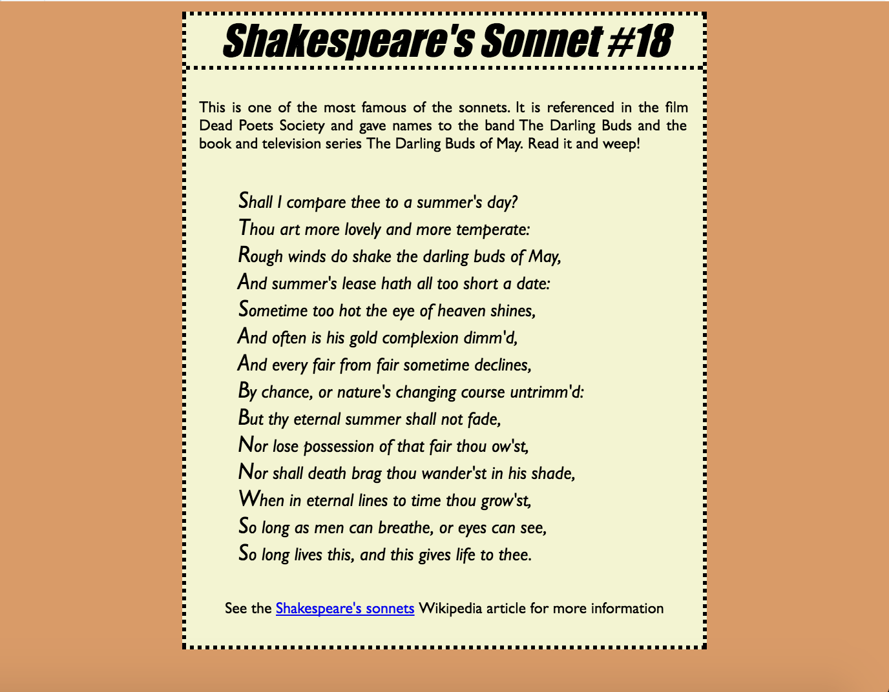

# WikiUniversity-CSS-Designs

TOok on the CSS Design Challenges here and replicated them on jsFiddles

https://en.wikiversity.org/wiki/Web_Design/CSS_challenges



html
```
<body>
  <div id="wrap">
    <h1>Shakespeare's Sonnet #18</h1>
    <p>
      This is one of the most famous of the sonnets. It is referenced in the film Dead Poets Society and gave names to the band The Darling Buds and the book and television series The Darling Buds of May. Read it and weep!
    </p>
    <ul>
      <li>Shall I compare thee to a summer's day?</li>
      <li>Thou art more lovely and more temperate:</li>
      <li>Rough winds do shake the darling buds of May,</li>
      <li>And summer's lease hath all too short a date:</li>
      <li>Sometime too hot the eye of heaven shines,</li>
      <li>And often is his gold complexion dimm'd,</li>
      <li>And every fair from fair sometime declines,</li>
      <li>By chance, or nature's changing course untrimm'd:</li>
      <li>But thy eternal summer shall not fade,</li>
      <li>Nor lose possession of that fair thou ow'st,</li>
      <li>Nor shall death brag thou wander'st in his shade,</li>
      <li>When in eternal lines to time thou grow'st,</li>
      <li>So long as men can breathe, or eyes can see,</li>
      <li>So long lives this, and this gives life to thee.</li>
    </ul>

    <p class="copyright">See the
      <a href="http://en.wikipedia.org/wiki/Shakespeare%27s_Sonnets">
      Shakespeare's sonnets</a> Wikipedia article for more information
    </p>
  </div>

```

css
```
body {
  background-color: #D99B68;
}

#wrap {
  background-color: #F3F4D2;
  border: dotted;
  width: 400px;
  margin: 0 auto;
}

h1 {
  border-bottom: dotted;
  margin: 0;
  font-family: Impact;
  font-style: italic;
  text-align: center;
}

p {
  font-family: Gill Sans;
  font-size: 12px;
  text-align: justify;
  padding: 10px;
}

.copyright {
  text-align: center;
}

li {
  font-style: italic;
  font-family: Gill Sans, sans-serif;
  font-size: 14px;
  list-style-type: none;
}

li::first-letter {
  font-size: 130%;
}

```
